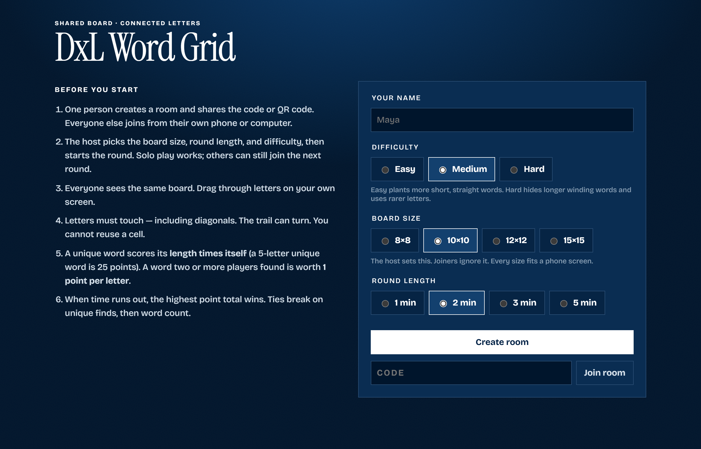

# DxL Word Grid

A timed, multiplayer word hunt. Each group gets a room. People join from their own phones or computers and hunt on the same board. Unique finds score more than words several people spotted.




## How to play

1. One person creates a room, then shares the 4-letter code or the QR code.
2. Everyone else opens the same site, types their name, and joins with that code.
3. The host starts the round. Board size, time, and difficulty are set by the host. Solo play works.
4. Drag through connected letters on your own screen. The trail can turn. You cannot reuse a cell. Finds must be in the ENABLE word list (about 160,000 English words, 3–12 letters).
5. Unique word: **length × length**. Shared word: **1 point per letter**.
6. When time ends, everyone sees the same point breakdown.

Several groups can play at once — each room is separate.

## How it's hosted

This mirrors the dxl-roguelite setup: a static frontend on GitHub Pages, a small serverless backend on AWS, no server to keep running.

- **Frontend (the web app)** — GitHub Pages, deployed by `.github/workflows/pages.yml`. It serves the static build from `apps/web/dist` (HTML/JS/CSS). Runs on GitHub's Pages/CDN, not AWS.
- **Backend (real-time multiplayer)** — API Gateway **WebSocket** + a single **Lambda** + **DynamoDB**, in `ca-central-1`. Rooms, players, finds, and live connections live in one DynamoDB table. Deployed with `pnpm deploy:lambdas`.
- **No GitHub login and no AI.** Players just type a name, exactly like before. Those pieces from the roguelite are intentionally left out.

### Cost

At this traffic level it sits inside the AWS free tier: Lambda, DynamoDB on-demand, and API Gateway WebSocket all have generous monthly allowances. All AWS resources are tagged `Project=dxl-word-grid` so cost can be tracked in isolation, and abandoned rooms self-expire via a DynamoDB TTL so nothing lingers. GitHub Pages hosting is free.

## Repository layout

```
apps/web/            Static frontend (Vite). index.html + src/{app.js,config.js,styles.css}
packages/engine/     Pure game rules (grid, validation, scoring) shared by web + lambda
services/ws/         WebSocket Lambda (rooms, players, finds; DynamoDB-backed)
infra/               Terraform: DynamoDB + WebSocket API + Lambda
scripts/             build-words.mjs, package-lambdas.mjs (esbuild bundle → zip)
```

## Local development

```bash
pnpm install
pnpm dev:web        # http://localhost:5173
```

The frontend needs a backend to talk to. Point it at the deployed WebSocket API:

```bash
# PowerShell
$env:VITE_WS_URL = "wss://<id>.execute-api.ca-central-1.amazonaws.com/dev"
pnpm dev:web
```

With `VITE_WS_URL` unset the client falls back to the page's own host, which has no
WebSocket server, so rooms will not connect. Set it before playing locally.

To refresh the word list in both places that need it (browser + Lambda):

```bash
pnpm words
```

## Deploy

Order matters: stand up AWS first (to get the WebSocket URL), then point the frontend at it.

### 1. Backend (AWS)

Dev account `376129877101`, region `ca-central-1`, profile `dev`, resource prefix `dxl-word-grid-dev-`.

```bash
aws sso login --profile dev
powershell -ExecutionPolicy Bypass -File infra/scripts/preflight.ps1   # read-only; aborts on name collisions
terraform -chdir=infra init
terraform -chdir=infra apply
```

This creates:

- DynamoDB table `dxl-word-grid-dev-rooms`
- Lambda `dxl-word-grid-dev-ws` (placeholder code)
- WebSocket API `dxl-word-grid-dev-ws` with stage `dev`

Note the `ws_stage_url` output, e.g. `wss://abc123.execute-api.ca-central-1.amazonaws.com/dev`.

Deploy the real Lambda code (bundles the handler + word list):

```bash
pnpm install
pnpm deploy:lambdas
```

Optional: set `PUBLIC_URL` before deploying so lobby join links use the Pages URL instead of a relative link:

```bash
$env:PUBLIC_URL = "https://ubcdigitalexperiencelab.github.io/dxl-word-grid"
pnpm deploy:lambdas
```

### 2. Frontend (GitHub Pages)

1. In the repo, enable Pages: **Settings → Pages → Build and deployment → Source: GitHub Actions**.
2. Add a repository variable **Settings → Secrets and variables → Actions → Variables** named `WS_URL`, set to the `ws_stage_url` from step 1.
3. Push to `main` (or run the **GitHub Pages** workflow manually). It builds `apps/web` with `BASE_PATH=/dxl-word-grid/` and bakes `VITE_WS_URL` in.

The site publishes at `https://ubcdigitalexperiencelab.github.io/dxl-word-grid/`.

## How the round timer works

Lambda cannot hold a `setTimeout` across invocations, so rounds end lazily. Each client runs its own countdown and, when it reaches zero, sends one `endcheck` message; the Lambda finalises the round and broadcasts final scores. A find submitted after time is up also triggers finalisation. No always-on process or scheduler is needed.

## Tests

```bash
npm test        # engine rules: scoring, path legality, grid generation
```

## Notes

- **The QR code is generated in the browser.** The old single-process server rendered it
  server-side with the `qrcode` package. Now the client builds the join URL and draws the
  QR itself, so the backend never has to produce an image.
- **Terraform state is local.** `infra/terraform.tfstate` is gitignored, so whoever ran
  the last apply holds the state. Move to a remote S3 backend if more than one person
  needs to manage this infrastructure.
