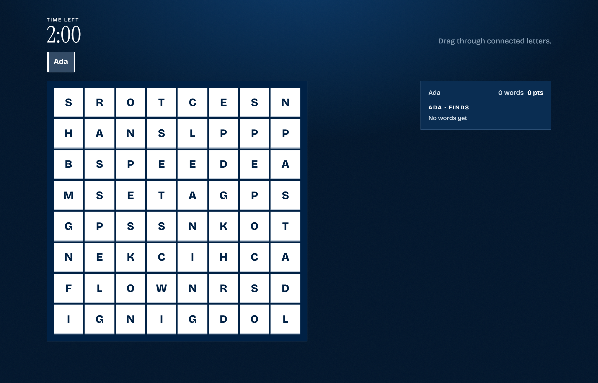

# DxL Word Grid

A timed, multiplayer word hunt. Each group gets a room. People join from their own phones or computers and hunt on the same board. Unique finds score more than words several people spotted.



## How to play

1. One person creates a room, then shares the 4-letter code or the QR code.
2. Everyone else opens the same site, types their name, and joins with that code.
3. The host starts the round. Board size, time, and difficulty are set by the host. Solo play works.
4. Drag through connected letters on your own screen. The trail can turn. You cannot reuse a cell.
5. Unique word: **length × length**. Shared word: **1 point per letter**.
6. When time ends, everyone sees the same point breakdown.

Several groups can play at once — each room is separate.

## Run

```bash
npm install
npm start
```

On this computer: [http://localhost:5173](http://localhost:5173)

On phones on the same network: use the `http://…:5173` address printed in the terminal.

Health check: [http://localhost:5173/health](http://localhost:5173/health)

Set `PUBLIC_URL` (no trailing slash) when the join QR should use a public hostname instead of a LAN IP:

```bash
PUBLIC_URL=https://word-grid.example.ca npm start
```

## Docker

```bash
docker build -t dxl-word-grid .
docker run --rm -p 5173:5173 -e PUBLIC_URL=http://localhost:5173 dxl-word-grid
```

## AWS (Terraform)

One Fargate task behind an ALB. Rooms are in memory — keep `desired_count` at 1.

1. Copy `terraform/terraform.tfvars.example` to `terraform/terraform.tfvars` and fill in VPC, subnets, and `public_url`.
2. Create the ECR repo first, then push an image, then apply the rest:

```bash
cd terraform
terraform init
terraform apply -target=aws_ecr_repository.app

aws ecr get-login-password --region ca-central-1 | docker login --username AWS --password-stdin <account>.dkr.ecr.ca-central-1.amazonaws.com
docker build -t dxl-word-grid ..
docker tag dxl-word-grid:latest <ecr-url>:latest
docker push <ecr-url>:latest

terraform apply
```

3. Open the ALB DNS name (or your Route 53 name). `GET /health` should return `{"ok":true}`.

HTTPS: put an ACM certificate ARN in this region in `certificate_arn`. HTTP-only works if you leave it empty.

If the task subnets have no NAT, set `assign_public_ip = true` so Fargate can pull from ECR.

## Telemetry

Each room writes usage data on this computer only (not to a third-party service):

- `telemetry/events.jsonl` — joins, finds, selections, screens, round start/end
- `telemetry/rooms.jsonl` — one summary per room when it closes: settings, time in room, visible time, rounds, scores

Player names and found words are included so you can see how a session went. The `telemetry/` folder is gitignored and is not served over HTTP.

## Tests

```bash
npm test
```
